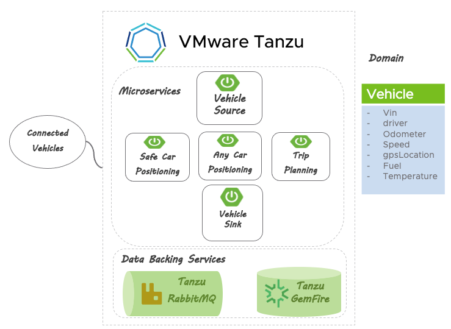

# IoT-data-showCase

**Use cases**

- Hundreds of thousands of vehicles driving across the globe, 24 hours a day, 7 days a week.
- Need to access aggregated real-time location, driving, behavior data, temperature sensors and more.

**Solution**

- Scalable, resiliency Kubernetes platform based on Tanzu
- Cloud Native Microservices based on Spring
- Reliable messaging deliverable with RabbitMQ
- Low latency data read/write operations with GemFire

**Demo/Records/Webinars**

- [Building Scalable Resilient IoT Messaging (RabbitMQ Summit)](https://www.youtube.com/watch?v=BWcofi2FKHo) 

# Project Modules

| Applications                                                     | Notes                                                                                        |
|------------------------------------------------------------------|----------------------------------------------------------------------------------------------|
| [applications/vehicle-dashboard](applications/vehicle-dashboard) | GUI interface to views vehicle information                                                   |
| [applications/vehicle-sink](applications/vehicle-sink)           | Microservice streaming sink for storing Vehicle data in GemFire                              |
| [vehicle-telemetry-sink](applications/vehicle-telemetry-sink)    | Microservice streaming sink for storing Vehicle data in GemFire                              |

