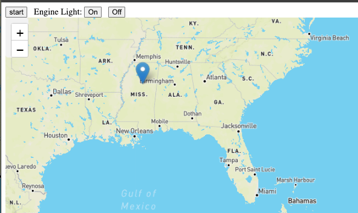

# Vehicle Server





## Running the server


```shell
java -jar applications/server/vehicle-server/target/vehicle-server-0.0.1-SNAPSHOT.jar --vehicle.vin=vin002 --server.port=7013 --gemfire.jmx.manager.port=20399 --gemfire.server.port=20300 --gemfire.startLocators="localhost[3010]" --gemfire.working.dir=runtime/vin003 --gemfire.distributedSystemId=3
```

