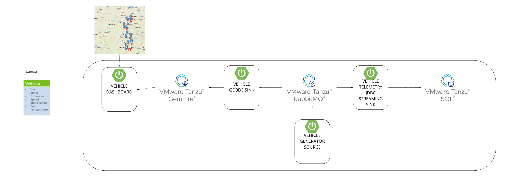
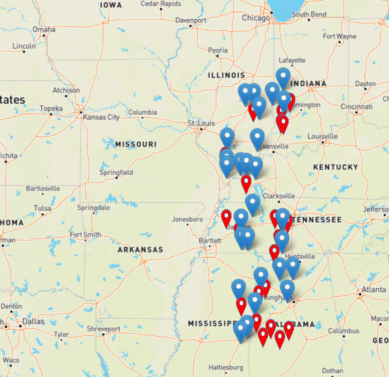

# IoT-data-workshop

**Use cases**

- Hundreds of thousands of vehicles driving across the globe, 24 hours a day, 7 days a week.
- Need to access aggregated real-time location, driving, behavior data, temperature sensors and more.

**Solution**

- Scalable, resiliency Kubernetes platform based on Tanzu
- Cloud Native Microservices based on Spring
- Reliable messaging deliverable with RabbitMQ
- Low latency data read/write operations with GemFire
- show telemetry in PostgreSQL



# Project Modules


Applications                                                                        |    Notes
-------------------------------------------------------------------------           |    ----------------------
[IoT-connected-vehicle-dashboard](applications/IoT-connected-vehicle-dashboard)     |    GUI interface to views vehicle information
[vehicles-geode-sink](applications/vehicles-geode-sink)                             |    Microservice sink for storing Vehicle data in GemFire
[vehicle-generator-source](applications/vehicle-generator-source)                   |    Car positioning data generator for vehicle details in JSON format

# Prerequisite
## required
- kubernetes env and kubectl（or Docker app with kubernetes)
- jdk: 11
- gradle: 6(if you are not sure which gradle version you are using, please try `gradle -v` and use `./gradlew` instead of `gradle`)
- kind and create kind cluster by `kind create cluster` https://kind.sigs.k8s.io/
- cert-manager(<=v1.2) https://cert-manager.io/docs/
- helm(>=v3) https://helm.sh/

## nice to have:

- k9s: to manage kubernetes in terminal. https://k9scli.io/
- kubectx: to switch kubernetes context. https://github.com/ahmetb/kubectx
- jenv: to switch jvm/jdk version. https://www.jenv.be/


# Preparation

## Build local images
1. clean and build local code
   
    ```shell script
    ./gradlew clean
    ./gradlew build
    ```

1. Use the following command to build docker images

    ```shell script
    ./gradlew :applications:vehicle-generator-source:bootBuildImage
    ./gradlew :applications:iot-connected-vehicle-dashboard:bootBuildImage
    ./gradlew :applications:vehicles-geode-sink:bootBuildImage
    ```
## K8s preparation
1. please ensure that new kind cluster had been created in the process of kind installation. If it didn't happen, please run following command to create a new kind cluster.

    `kind create cluster`

2. switch kind context

   `kubectl config use-context kind-kind`

   Or

   `kubectx kind-kind`

1. create namespace

   `kubectl create namespace tds-workshop`

## Installation of Tanzu Data Service Operators
1. install operators of VMware Tanzu GemFire for Kubernetes(v1.0), VMware Tanzu RabbitMQ for Kubernetes(v1.1.0) and VMware Tanzu SQL with Postgres for Kubernetes(v1.2) to the namespace `tds-workshop`

Tanzu Products | URL
---------------|--------
VMware Tanzu GemFire for Kubernetes(v1.0)           | https://tgf.docs.pivotal.io/tgf/1-0/index.html
VMware Tanzu RabbitMQ for Kubernetes(v1.1.0)        | https://docs.pivotal.io/tanzu-rabbitmq/1-0/kubernetes/tanzu/installation.html
VMware Tanzu SQL with Postgres for Kubernetes(v1.2) | https://postgres-kubernetes.docs.pivotal.io/1-2/index.html

# Accessing K8 Services
## RabbitMQ Access
1. Get the RabbitMQ user/password, please keep $ruser and $rpwd on note, later you can login RabbiMQ Management UI by it.
    ```shell script
    kubectl -n tds-workshop get secret rabbitmq-default-user -o jsonpath="{.data.username}"
    
    export ruser=`kubectl -n tds-workshop get secret rabbitmq-default-user -o jsonpath="{.data.username}"| base64 --decode`
    export rpwd=`kubectl -n tds-workshop get secret rabbitmq-default-user -o jsonpath="{.data.password}"| base64 --decode`
    
    echo ""
    echo "USER:" $ruser
    echo "PASWORD:" $rpwd
    ```

2. start RabbitMQ with 3 nodes

    ```shell script
    kubectl -n tds-workshop apply -f cloud/k8/data-services/rabbitmq/local-cluster-node3.yml
    ```

3. Add new user and set permission

    ```shell
    # <user>: vehicle
    # <password>: security
    kubectl -n tds-workshop exec rabbitmq-server-0 -- rabbitmqctl add_user <user> <password>
    
    kubectl -n tds-workshop exec rabbitmq-server-0 -- rabbitmqctl set_permissions  -p / <user> ".*" ".*" ".*"
    
    kubectl -n tds-workshop exec rabbitmq-server-0 -- rabbitmqctl set_user_tags <user> administrator
    
    ```
4. forward port of RabbitMQ
   1. normal
       ```shell script
       kubectl -n tds-workshop port-forward rabbitmq-server-0 15672:15672
       ```
   2. in nohup mode, later the log file can be monitored by `tail -f`
       ```shell script
       kubectl -n tds-workshop port-forward rabbitmq-server-0 15672:15672 > /tmp/k8s-rabbitMq1.log &
       ```
## GemFire

1. start GemFire to 1 locator and 2 datanodes

    ```shell script
    kubectl -n tds-workshop apply -f cloud/k8/data-services/gemfire/gf-cluster-locators-2-datanodes-3.yml
    ```
1. create Region in GemFire
   
   `kubectl -n tds-workshop exec -it gemfire1-locator-0 -- gfsh -e "connect" -e "create region --name=Vehicle --eviction-action=local-destroy --eviction-max-memory=10000 --entry-time-to-live-expiration=60 --entry-time-to-live-expiration-action=DESTROY --enable-statistics=true --type=PARTITION"`

# Apps

1. load docker-image of apps

    ```shell script
    kind load docker-image vehicle-generator-source:0.0.4-SNAPSHOT
    kind load docker-image iot-connected-vehicle-dashboard:0.0.4-SNAPSHOT
    kind load docker-image vehicles-geode-sink:0.0.4-SNAPSHOT
    ```

2. add vehicle-secrets to kubernetes
    ```shell script
    kubectl apply -f cloud/k8/secrets -n tds-workshop
    ```

3. add config-map to kubernetes
    ```shell script
    kubectl create -f cloud/k8/apps/config-maps.yml -n tds-workshop
    ```

4. deploy pods

    ```shell script
    kubectl apply -f cloud/k8/iot-connected-vehicle-dashboard.yml -n tds-workshop
    kubectl apply -f cloud/k8/apps/source/vehicle-generator-source/vehicle-generator-source.yml -n tds-workshop
    kubectl apply -f cloud/k8/apps/sink/geode-sink/vehicles-geode-sink.yml -n tds-workshop
    ```

5. forward port of vehicle-dashboard
   1. normal
       ```shell
       kubectl -n tds-workshop port-forward iot-connected-vehicle-dashboard 7000:7000
       ```
   1. nohup mode, later the log file can be monitored by `tail -f`
      ```shell
      kubectl -n tds-workshop port-forward iot-connected-vehicle-dashboard 7000:7000 >/tmp/iot-dashboard1.log&
       ```
6. view the page of vehicle-dashboard
   1. CHROME - open http://localhost:7000
   
   

# FAQ
1. gradle version 
   
    if you are not sure the gradle version on your env will match this repo,  please use `./gradlew` instead of `gradle`
1. Kubernetes namespace
   
    if you choose to run all the app and data service in a namespace other than default namespace, please ensure all the commands running under same namespace.
1. debug related commands
   
   [debug help](README-debug.md)
   
1. OOM(out of memory) or insufficient resource error
   
   please assign more resource(CPU and memory) to pod or data services.